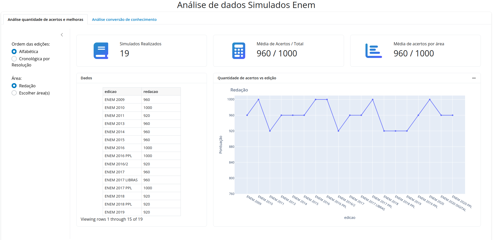
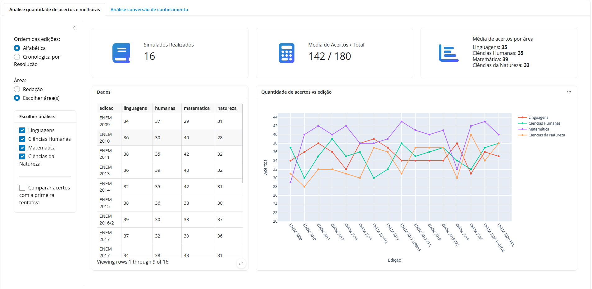
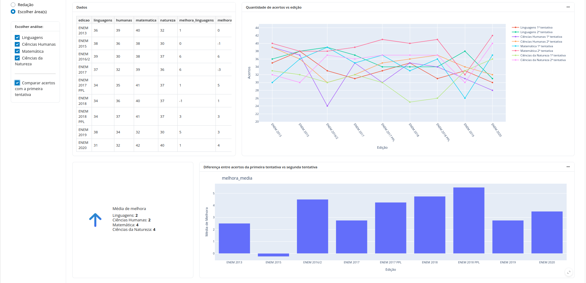

# FIPE
<details>
  <summary>Table of Contents</summary>
  <ol>
    <li><a href="#about-the-project">About The Project</a></li>
    <li><a href="#preview">Preview</a></li>
    <li>
      <a href="#getting-started">Getting Started</a>
      <ul>
        <li><a href="#requirements">Requirements</a></li>
        <li><a href="#running-from-scratch">Running the application</a></li>
      </ul>
    </li>
    <li><a href="#roadmap">Roadmap</a></li>
  </ol>
</details>

<!-- ABOUT THE PROJECT -->
<a name="about-the-project"></a>
## About The Project
During my period of study to enter the university, I took numerous mock tests for the ENEM (Exame Nacional do Ensino Médio, the National High School Exam in Brazil). Throughout this time, I gathered extensive data from these mock tests. Leveraging this data, I developed a web application written in Python to analyze the results. This project aims to provide insights and identify trends in my performance across different subjects.

<a name="preview"></a>
## Preview

Essay Grades:


Overall Performance Across All Subjects:


Comparing Overall Performance Between Two Attempts:


<!-- GETTING STARTED -->
<a name="#getting-started"></a>
## Getting Started

<!-- REQUIREMENTS -->
<a name="#requirements"></a>
### Requirements

1. Make sure you have Python installed. If not, you can download it from [here](https://www.python.org/downloads/).
2. Install the required packages using the package manager [pip](https://pip.pypa.io/en/stable/).

   ```bash
   $ pip install -r requirements.txt
<!-- RUNNING THE APPLICATION -->
<a name="#running-the-app"></a>
### Running the application
This app is hosted on the following website:  
https://enem.stuaninauts.com


Or, if you want to run locally,

    $ cd src/data_analysis
    $ shiny run --reload


<!-- ROADMAP -->
<a name="roadmap"></a>
## Roadmap
- [] Fix Análise de Conversão de Conhecimento tab 